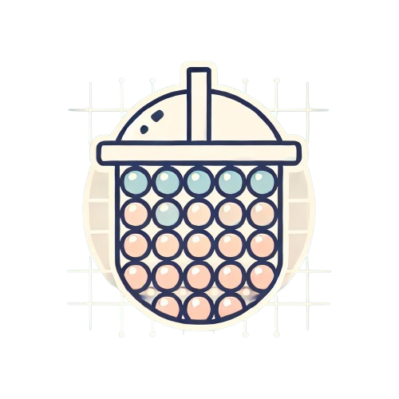

<p align="center">
  
</p>
# Bubble Grid

A flexible stacked grid layout component for [Bubble Tea](https://github.com/charmbracelet/bubbletea) TUI applications.

## Features

- Create multi-column grid layouts
- Stack items vertically within columns
- Automatic screen-fitting with `FitScreen` option
- Frame component with borders and padding
- Support for nested components
- Implement your size-aware components through `Sizer` interface

## Installation

```bash
go get github.com/shahar3/bubble-grid
```

## Usage

Here's a simple example using the grid with frames:

```go
package main

import (
    "github.com/shahar3/bubble-grid/grid"
    "github.com/shahar3/bubble-grid/frame"
    tea "github.com/charmbracelet/bubbletea"
)

// Create a component that implements grid.Item
type SimpleItem struct {
    content string
}

func (s SimpleItem) Render() string {
    return s.content
}

// Create a Bubble Tea model
type ExampleModel struct {
    grid *grid.StackedGrid
}

func main() {
    // Create a new grid
    g := grid.NewStackedGrid()

    // Create items with frames
    item1 := SimpleItem{"Item 1"}
    framedItem1 := frame.NewFrame(item1)

    // Add items to the grid
    g.AddItem(framedItem1, grid.ItemOptions{
        Column: 0,
    })

    // Create and run the program
    p := tea.NewProgram(ExampleModel{grid: g}, tea.WithAltScreen())
    if _, err := p.Run(); err != nil {
        panic(err)
    }
}
```

### Grid Options

When creating a grid, you can specify these options:

- `FitScreen`: Whether the grid should automatically fit items to screen dimensions

When adding items to the grid, you can specify:

- `Column`: Which column to place the item in (0-based index)

### Frame Component

The Frame component provides a bordered container for your content:

```go
// Basic frame
frame := frame.NewFrame(content)

// Customize frame
frame = frame.ChangeBorderColor(lipgloss.Color("#874BFD"))

// Add to grid
g.AddItem(frame, grid.ItemOptions{Column: 0})
```

### Size-Aware Components

Components can implement the `Sizer` interface to handle their own sizing:

```go
type Sizer interface {
    Item
    SetSize(width, height int) Sizer
}
```

## Contributing

Contributions are welcome! Please feel free to submit a Pull Request.

## License

MIT License
